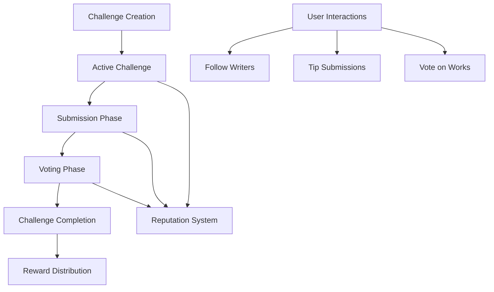

# Channel Closed GUI: Creative Writing Challenge Platform

Channel Closed is an innovative blockchain-powered platform that transforms creative writing into an engaging, rewarding community experience. By leveraging smart contracts, we create a transparent ecosystem where writers can showcase their work, readers can discover talent, and creativity is directly incentivized.

## Overview

Channel Closed reimagines writing challenges through:
- Community-driven writing competitions
- Transparent voting mechanisms
- Fair reward distribution
- Genre-specific reputation building

### Key Features

- Themed writing challenges
- Decentralized submission and voting
- Blockchain-verified content ownership
- Reputation and social interaction systems

## Architecture



## Getting Started

### Prerequisites
- Clarinet CLI
- Stacks wallet

### Quick Start

1. Create a Challenge
```clarity
(contract-call? .channel-closed create-challenge 
    "Summer Story Sprint" 
    u"Craft a compelling narrative about summer adventures" 
    "fiction" 
    u43200 
    u43200 
    u100000 
    u1000000)
```

2. Submit Work
```clarity
(contract-call? .channel-closed submit-work 
    u1 
    "Sunset Memories" 
    0x...)
```

3. Vote on Submissions
```clarity
(contract-call? .channel-closed vote-for-submission u1)
```

## Development

### Setup
1. Clone repository
2. Install dependencies: `clarinet install`
3. Run tests: `clarinet test`

### Local Development
1. Start Clarinet console: `clarinet console`
2. Deploy contract: `(contract-call? .channel-closed ...)`

## Security Considerations

- Maximum 100 submissions per challenge
- Challenge duration: 12 hours to 6 months
- Platform fee: 5% of total rewards
- Transparent voting and reward mechanisms

## Reward Distribution
- First place: 50%
- Second place: 30%
- Third place: 15%
- Challenge creator: 5%

## Contributing

We welcome contributions! Please read our contribution guidelines and code of conduct.

## License

[Insert appropriate license]